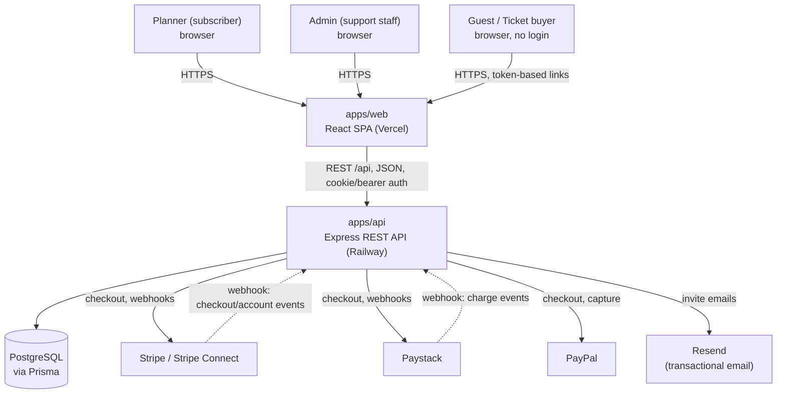

# 01 — Application Overview

Evidence framework: CONFIRMED (cited file path) / INFERRED (reasoned, not directly stated) / UNKNOWN ("Not determined from the available source code/project artefacts").

## 1.1 What EventFlow is

EventFlow is a monorepo SaaS application for event planning, guest RSVP management, visual seating planning, vendor tracking, merchandise sales, and public paid ticketing. CONFIRMED — root `package.json` names the npm workspaces `apps/api` and `apps/web`; `apps/api/prisma/schema.prisma` header comment reads "Event RSVP & Visual Seating Planner - Database Schema".

The repository contains two applications:

- **`apps/api`** — a TypeScript Express REST API using Prisma as its ORM against PostgreSQL. CONFIRMED — `apps/api/package.json` (`express`, `@prisma/client`), `apps/api/prisma/schema.prisma` (`provider = "postgresql"`).
- **`apps/web`** — a TypeScript React 18 single-page application built with Vite and styled with Tailwind CSS. CONFIRMED — `apps/web/package.json` (`react@^18.3.1`, `vite@^5.4.8`, `tailwindcss@^3.4.13`).

## 1.2 Who it is for

Three user personas are directly supported by distinct authentication/authorization paths in the code:

1. **Planner (subscriber)** — the primary paying user. Creates an account (`UserRole.PLANNER`, the schema default), creates and manages events, guests, seating, vendors, merchandise, and tickets for events they own. CONFIRMED — `apps/api/prisma/schema.prisma` (`enum UserRole { PLANNER ADMIN }`, `role UserRole @default(PLANNER)`).
2. **Admin (internal support staff)** — an internal EventFlow role with `UserRole.ADMIN`. Can browse all subscribers and events, and can act on any subscriber's event through the same endpoints a planner uses, via an ownership bypass; every such mutation is written to an audit log. CONFIRMED — `apps/api/src/modules/events/events.service.ts` (`getOwnedEvent`), `apps/api/src/middleware/auditAdminEventActions.ts`.
3. **Guest / ticket buyer (unauthenticated public user)** — never logs in. Reaches the app through one of several unguessable bearer tokens (an event's `rsvpToken`, a personal `EventInvitation.token`, or a public event's `publicSlug`) to RSVP, buy merchandise, or buy tickets. CONFIRMED — `apps/api/src/modules/rsvp/rsvp.routes.ts`, `apps/api/src/modules/tickets/checkout.routes.ts`.

## 1.3 Core capability map

| Capability | Confirmed by |
|---|---|
| Account registration/login (email + password, JWT) | `apps/api/src/modules/auth/*` |
| Event CRUD, cover image upload | `apps/api/src/modules/events/*` |
| Guest list management, CSV import/export, PDF exports | `apps/api/src/modules/guests/*` |
| Personalised + shared-link RSVP, QR invites, email sending (Resend) | `apps/api/src/modules/rsvp/*`, `apps/api/src/modules/guests/invite.service.ts` |
| Uploadable, host-designed invitation card (PDF/PNG/JPEG) attached to invite emails | `apps/api/src/modules/events/invitationCard.service.ts` |
| Visual drag-and-drop seating planner (tables, seats, venue layout objects) | `apps/api/src/modules/seating/*`, `apps/web/src/pages/events/seating/*` |
| Door check-in (manual + QR scan) for private-event guests | `apps/api/src/modules/guests/guests.controller.ts` (`checkInScan`), `apps/web/src/pages/events/CheckInTab.tsx` |
| Vendor tracking with multi-currency cost totals | `apps/api/src/modules/vendors/*` |
| Merchandise shop (products, guest checkout, stock decrement) | `apps/api/src/modules/products/*` |
| Multi-processor payments (Stripe Connect, Paystack, PayPal) with per-event, per-currency payout accounts | `apps/api/src/modules/payouts/*`, `apps/api/src/lib/stripeClient.ts`, `apps/api/src/lib/paystackClient.ts`, `apps/api/src/lib/paypalClient.ts` |
| Public ticketed events: ticket types, public listing page, guest checkout, QR ticket issuance, door scan | `apps/api/src/modules/tickets/*` |
| In-app notifications (RSVP changes, vendor status, paid orders) | `apps/api/src/modules/notifications/*` |
| "Needs Attention" cross-event insights | `apps/api/src/modules/insights/*` |
| Per-planner and platform-wide analytics | `apps/api/src/modules/analytics/*`, `apps/api/src/modules/admin/admin.service.ts` (`getPlatformAnalytics`) |
| Admin support tooling (user/event browser, audit log, payment event log) | `apps/api/src/modules/admin/*` |
| Public marketing site: landing page, FAQ, admin-managed "Services" cards, admin-authored articles/blog | `apps/web/src/pages/marketing/*`, `apps/api/src/modules/landing/*`, `apps/api/src/modules/articles/*` |
| PWA installability (manifest + service worker + install prompt) | `apps/web/public/manifest.webmanifest`, `apps/web/public/sw.js`, `apps/web/src/components/InstallPrompt.tsx` |

## 1.4 High-level context diagram

CONFIRMED (component/relationship existence) — see `apps/api/src/app.ts` for route mounting, `apps/api/src/modules/products/webhook.routes.ts` for inbound webhooks, `apps/api/src/modules/guests/invite.service.ts` for Resend usage. INFERRED — the diagram's visual layout and grouping; the underlying facts are CONFIRMED individually as cited.

## 1.5 What this document does not cover

Business metrics such as active subscriber counts, revenue, or usage volume are UNKNOWN — Not determined from the available source code/project artefacts. This pack documents the application's built capabilities, not its commercial performance.
