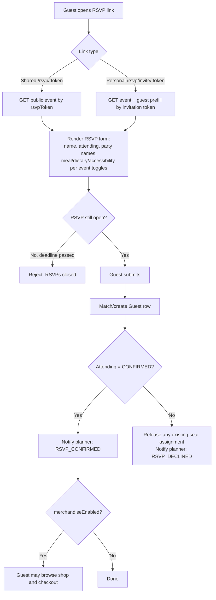
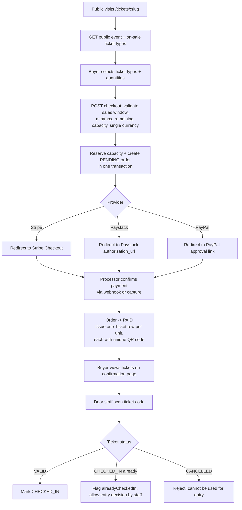

# 06 — UI/UX Specification

Screen inventory is CONFIRMED against `apps/web/src/App.tsx` (route table) and the corresponding page component files (all confirmed to exist via `apps/web/src/pages/**/*.tsx`). Field-level and interaction-level detail for each screen reflects direct code review performed across this documentation effort and prior work in this project; where a specific screen's internals were not re-verified in this pass, that is marked INFERRED (from component/hook naming) rather than presented as directly observed.

## 6.1 Navigation shell

`apps/web/src/components/layout/DashboardLayout.tsx` (CONFIRMED, full file reviewed) is the single shared shell for every authenticated route. It renders a top navigation bar (not a sidebar — the code comment notes this replaced an earlier left-sidebar design) that switches content based on context:

- **Outside an event** ("global" mode): "My Events" and "Analytics" links, plus "Admin" if `user.role === "ADMIN"`.
- **Inside an event** (`/events/:eventId/...`): eight tabs — Overview, Guests, RSVP, Vendors, Merchandise, Tickets, Seating, Check-in — each with an icon and a hover/focus tooltip (via the shared `Tooltip` component) describing its purpose.

When an admin has drilled into a subscriber's event they don't own (`event.userId !== user.id`), a "Support view — editing as admin" badge appears in the event sub-header, and the delete-event button is hidden (deleting is owner-only server-side; hiding it client-side avoids a confusing failed request). A mobile hamburger menu collapses the same nav for small screens.

Global chrome present on every authenticated screen: a notification bell (`NotificationBell.tsx`, shows unread count, dropdown list, "mark all read") and a user menu (`UserMenu.tsx`, avatar with initials + online-style dot, dropdown with "Log out" — which navigates to `/`, the landing page, per the current implementation).

## 6.2 Screen inventory

| Route | Component | Auth | Purpose |
|---|---|---|---|
| `/` | `pages/marketing/LandingPage.tsx` | Public | Marketing homepage: hero, services grid ("How it works"), payments callout, FAQ accordion, articles teaser, CTA banner |
| `/articles` | `pages/marketing/ArticlesListPage.tsx` | Public | Published blog article listing |
| `/articles/:slug` | `pages/marketing/ArticleDetailPage.tsx` | Public | Single article view |
| `/login` | `pages/auth/LoginPage.tsx` | Public | Email/password login |
| `/register` | `pages/auth/RegisterPage.tsx` | Public | Account creation |
| `/rsvp/:token` | `pages/rsvp/PublicRsvpPage.tsx` | Public (token) | Shared-link RSVP form + shop (`ShopSection.tsx`) |
| `/rsvp/invite/:invitationToken` | `pages/rsvp/PublicRsvpPage.tsx` | Public (token) | Personalised, pre-filled RSVP form |
| `/tickets/:slug` | `pages/tickets/PublicTicketEventPage.tsx` | Public (slug) | Public ticket listing + checkout |
| `/events` | `pages/events/EventsListPage.tsx` | Auth | "My Events" dashboard — event cards with RSVP/table progress |
| `/events/:eventId` | *(redirect)* | Auth | Redirects to `.../overview` |
| `/events/:eventId/overview` | `pages/events/OverviewTab.tsx` (via `EventTabPages.tsx`) | Auth | Per-event readiness dashboard, quick-access panel, stat cards |
| `/events/:eventId/guests` | `pages/events/GuestsTab.tsx` | Auth | Guest list, search/filter, CSV import/export, PDF export |
| `/events/:eventId/rsvp` | `pages/events/RsvpTab.tsx` | Auth | RSVP funnel dashboard, invite sending, invitation card upload |
| `/events/:eventId/vendors` | `pages/events/VendorsTab.tsx` | Auth | Vendor CRUD, per-currency cost totals |
| `/events/:eventId/merchandise` | `pages/events/MerchandiseTab.tsx` | Auth | Product CRUD, order summary, payouts settings entry point |
| `/events/:eventId/tickets` | `pages/events/TicketsTab.tsx` | Auth | Ticket type CRUD, publish/public-listing settings (`PublishSettingsPanel.tsx`) |
| `/events/:eventId/seating` | `pages/events/seating/SeatingTab.tsx` | Auth | Visual drag-and-drop seating canvas (`SeatingCanvas.tsx`, Konva-based), guest sidebar, selection panel |
| `/events/:eventId/checkin` | `pages/events/CheckInTab.tsx` | Auth | Manual + QR-scan (`TicketScanPanel.tsx`) check-in kiosk view |
| `/analytics` | `pages/analytics/AnalyticsPage.tsx` | Auth | Cross-event analytics for the logged-in planner |
| `/admin` | `pages/admin/AdminPage.tsx` (+ `PlatformAnalyticsTab.tsx`, `ArticlesTab.tsx`, `ServicesTab.tsx`) | Auth + ADMIN | Subscriber/event browser, audit log, payment log, platform analytics, articles/services management |
| `*` (unmatched) | *(redirect)* | — | Redirects to `/events` |

CONFIRMED — route table in `apps/web/src/App.tsx`; component file existence via `Glob` of `apps/web/src/pages/**/*.tsx`.

## 6.3 Route protection

- `ProtectedRoute` (`apps/web/src/components/ProtectedRoute.tsx`): while `AuthContext`'s `isLoading` is true, renders a spinner; once resolved, redirects to `/login` (preserving the attempted location in router state) if no user is present, otherwise renders the nested route via `<Outlet />`.
- `AdminRoute`: same pattern, but redirects non-`ADMIN` users to `/events` rather than `/login` — this is a client-side convenience only; the API independently enforces `requireAdmin` on every `/api/admin/*` call regardless of what the UI shows.

## 6.4 Design system

CONFIRMED from `apps/web/tailwind.config.js` and this project's own prior styling work: a "duotone" palette with `brand` (violet/purple, primary — buttons, links, active nav state) and `coral` (secondary accent — used for select stat cards, scarcity badges, and alternating icon tiles across the planner dashboard, Overview, Analytics, Vendors, and Merchandise screens specifically, per this session's earlier UI work) plus a retinted `slate` neutral scale and semantic `success`/`warning`/`danger`/`info` ramps. Fonts: DM Sans (body) and Outfit (display), loaded via `@fontsource/*` packages (CONFIRMED, `apps/web/package.json`). Deliberately **not** applied to Guests/RSVP/Seating/Check-in status indicators, which rely on semantic (not brand) colour to convey RSVP/check-in state — an explicit scoping decision made during this project's styling work, not a limitation discovered by omission.

Shared UI primitives (CONFIRMED file existence, `apps/web/src/components/ui/*`): `Button`, `Badge`, `Card`/`StatCard`, `Modal`, `Input`, `Tooltip`, `Spinner`, `EmptyState`, `Avatar`, `ProgressBar`, `Stepper`, `DonutChart`, `RadialProgress`, `TrendChart`, `CategoryChart`, `ChartTypeToggle`, `ExportMenu`, `QrScanner`, `AuthedImage`.

## 6.5 Key interaction patterns

- **Tooltips on hover/focus**: nav tabs and icon-only buttons (notification bell, remove/edit icon buttons on Vendors/Tickets/Merchandise) show a descriptive label on hover or keyboard focus via the shared `Tooltip` component (CSS-only, `group/tooltip` pattern — CONFIRMED, `apps/web/src/components/ui/Tooltip.tsx`).
- **Multi-currency totals**: any stat card summing money across records that may span currencies (Vendors "Total Cost", Analytics "Vendor Spend") renders one line per currency with its own symbol, rather than a single figure with a fixed `$` icon — CONFIRMED, `apps/web/src/lib/format.ts` (`formatMoneyBreakdownSymbols`/`formatMoneyBreakdownParts`), applied in `VendorsTab.tsx` and `AnalyticsPage.tsx`.
- **Empty/loading/error states**: `EmptyState` and `Spinner` components exist and are used across list-type screens (INFERRED as a general pattern from component naming and prior-session UI polish work covering this explicitly — see Known Issues for any specific screen where this wasn't verified this pass).
- **Toasts**: `sonner` (CONFIRMED, `apps/web/package.json`) is used for transient success/error feedback (e.g. "Event deleted") — seen directly in `DashboardLayout.tsx`'s delete-event handler.
- **PWA install prompt**: `InstallPrompt.tsx`, rendered at the app root outside the route tree, listens for the browser's install-eligibility signal and offers a banner (INFERRED standard `beforeinstallprompt` pattern from the component's existence and mount location; internals not re-read this pass).

## 6.6 User flow diagrams

### Guest RSVP flow

CONFIRMED against `apps/api/src/modules/rsvp/rsvp.service.ts`, `apps/api/src/modules/notifications/notifications.service.ts`.

### Ticket purchase and door check-in flow

CONFIRMED against `apps/api/src/modules/tickets/checkout.service.ts`, `ticketTypes.service.ts`, `apps/api/src/modules/products/orders.service.ts`.

## 6.7 Screens not independently verified this pass

Field-by-field form contents of `EventFormModal`, `GuestFormModal`, `CsvImportModal`, `InviteModal`, `VendorFormModal`, `ProductFormModal`, `TicketTypeFormModal`, `ServiceFormModal`, and `ArticleFormModal` were not re-read line-by-line during this documentation pass (their existence and general purpose are CONFIRMED by filename and route wiring; their exact field list is INFERRED from the corresponding backend Zod schema, which does constrain what a well-behaved form must submit). Treat exact on-screen field order/labels as INFERRED, not CONFIRMED, until cross-checked directly against these component files.
