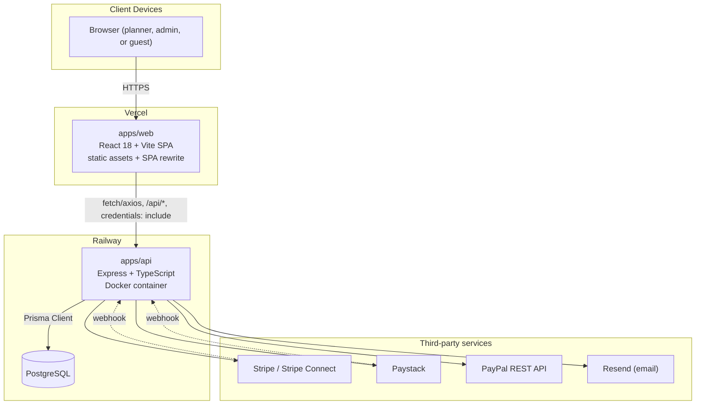
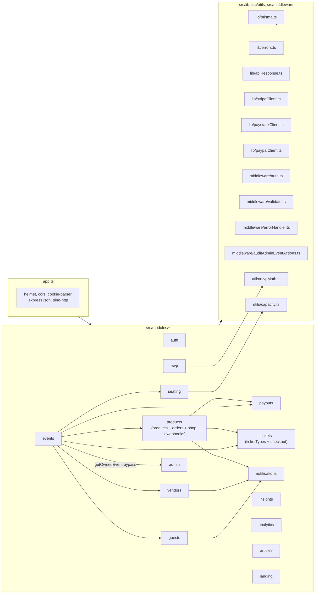
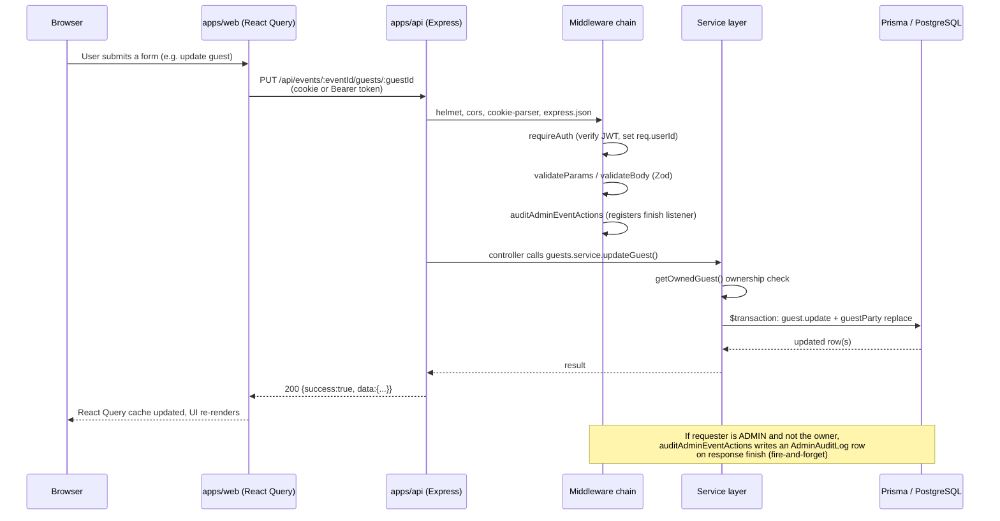
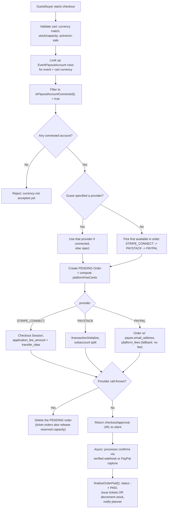

# 07 — System Architecture

## 7.1 High-level architecture


CONFIRMED — `apps/api/railway.json` (Dockerfile build, `prisma migrate deploy` on boot, `/health` healthcheck), `apps/web/vercel.json` (`npm run build`, `dist` output, SPA rewrite to `index.html`), `apps/api/src/lib/prisma.ts`, `apps/api/src/lib/stripeClient.ts`/`paystackClient.ts`/`paypalClient.ts`, `apps/api/src/modules/guests/invite.service.ts` (Resend).

## 7.2 Component / module architecture (backend)


CONFIRMED — direct import graph observed across `apps/api/src/app.ts` and each module's `*.routes.ts`/`*.service.ts` (e.g. `events.routes.ts` mounting `guestsRouter`/`seatingRouter`/`vendorsRouter`/`productsRouter`/`ordersRouter`/`payoutsRouter`/`ticketTypesRouter`; `tickets/checkout.service.ts` importing `startStripeCheckout` etc. directly from `products/orders.service.ts`; `rsvp.service.ts` calling `notifications.service.ts`).

## 7.3 Request / data flow (typical authenticated write)


CONFIRMED — `apps/api/src/app.ts` middleware order, `apps/api/src/middleware/*`, `apps/api/src/modules/guests/guests.service.ts` (`updateGuest`), `apps/api/src/middleware/auditAdminEventActions.ts`. React Query usage on the frontend is CONFIRMED by `apps/web/package.json` (`@tanstack/react-query`) and the `hooks/use*.ts` file set; exact cache-invalidation behaviour per hook is INFERRED (standard React Query pattern), not re-verified hook-by-hook this pass.

## 7.4 Authentication flow

```mermaid
sequenceDiagram
    participant B as Browser
    participant A as apps/api
    participant DB as PostgreSQL

    B->>A: POST /api/auth/login {email, password}
    A->>DB: findUnique(email)
    DB-->>A: user row (or null)
    A->>A: bcrypt.compare(password, passwordHash)
    alt invalid credentials
        A-->>B: 401 UNAUTHORIZED "Invalid email or password"
    else valid
        A->>A: jwt.sign({userId}, JWT_SECRET, {expiresIn: 7d})
        A-->>B: Set-Cookie: event_rsvp_token (httpOnly, secure in prod,<br/>sameSite=none in prod); body also includes token
    end

    Note over B,A: Subsequent requests
    B->>A: Any /api/* request<br/>(cookie sent automatically, or Authorization: Bearer <token>)
    A->>A: extractToken(): cookie first, then Bearer header
    A->>A: jwt.verify(token, JWT_SECRET)
    alt invalid/expired/missing
        A-->>B: 401 UNAUTHORIZED
    else valid
        A->>A: req.userId = payload.userId
        A->>A: (requireAdmin routes only) DB lookup: role === ADMIN?
        A-->>B: proceed to route handler
    end
```
CONFIRMED — `apps/api/src/modules/auth/auth.controller.ts`, `auth.service.ts`, `apps/api/src/middleware/auth.ts`, `apps/api/src/utils/jwt.ts`, `apps/api/src/utils/password.ts`.

## 7.5 Major business workflow — multi-processor checkout routing


CONFIRMED — `apps/api/src/modules/products/orders.service.ts` (`createCheckoutSession`, `DEFAULT_PROVIDER_PREFERENCE`, `finalizeOrderPaid`), `apps/api/src/modules/tickets/checkout.service.ts` (`createTicketCheckoutSession`, reusing the same starters). This single flow serves both the merchandise shop and public ticket sales, differentiated only by `Order.kind`.

## 7.6 Deployment topology

- `apps/api` builds via a Dockerfile on Railway; the container's start command runs `prisma migrate deploy` (25-second timeout, logged but not fatal if it times out — the server starts regardless) then `node dist/index.js`; Railway health-checks `GET /health` (30s timeout, restarts on failure up to 3 times). CONFIRMED — `apps/api/railway.json`.
- `apps/web` builds via `npm run build` (tsc + vite build) on Vercel, serving the `dist` directory with a catch-all rewrite to `index.html` for client-side routing. CONFIRMED — `apps/web/vercel.json`.
- Local development uses a single `docker-compose.yml` Postgres 16-alpine service; no other services (Redis, queues, etc.) are present in local dev tooling. CONFIRMED — `docker-compose.yml`.

See [15-deployment-and-infrastructure.md](15-deployment-and-infrastructure.md) for full detail.
