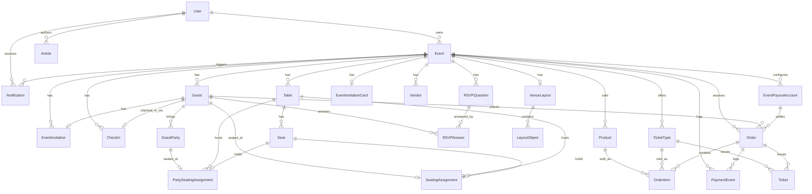

# 08 — Database Documentation

Source of truth: `apps/api/prisma/schema.prisma` (938 lines, PostgreSQL provider, Prisma Client 5). All 27 models below are CONFIRMED directly from this file. Field types shown are the Prisma schema types (not the raw Postgres column types, which Prisma derives automatically).

## 8.1 Entity-Relationship Diagram

CONFIRMED — all relations traced directly from `@relation` fields in `apps/api/prisma/schema.prisma`.

## 8.2 Model reference

For every model: field name, Prisma type, notes, Evidence (always `apps/api/prisma/schema.prisma`, model name given for lookup).

### User (`users`)
| Field | Type | Notes |
|---|---|---|
| id | String @id | cuid() |
| email | String @unique | |
| passwordHash | String | bcrypt, 12 rounds — see `utils/password.ts` |
| name | String | |
| role | UserRole @default(PLANNER) | `PLANNER \| ADMIN` |
| createdAt / updatedAt | DateTime | |

### Event (`events`)
| Field | Type | Notes |
|---|---|---|
| id | String @id | cuid() |
| userId | String, FK → User, onDelete Cascade | |
| name, type, description, date, startTime, endTime, venueName, venueAddress, capacity, imageUrl | mixed | `type` default `OTHER` |
| rsvpToken | String @unique @default(cuid()) | bearer credential for the public RSVP page |
| rsvpOpen | Boolean @default(true) | |
| rsvpDeadline | DateTime? | |
| customMessage | String? | |
| isPublic | Boolean @default(false) | switches event into public-ticketing mode |
| publicCategory | PublicEventCategory? | `NIGHTLIFE \| BOAT_CRUISE \| CONCERT \| FESTIVAL \| COMEDY_SHOW \| PRIVATE_PARTY \| OTHER` |
| publicSlug | String? @unique | generated once, immutable |
| publicDescription, minAge | mixed | |
| coverImageData / coverImageMimeType | Bytes? / String? | image stored in Postgres |
| allowPlusOnes, allowPlusOneNames, allowMealSelection, allowDietary, allowAccessibilityInfo, allowSpecialRequests | Boolean, all @default(true) | RSVP form feature toggles |
| merchandiseEnabled | Boolean @default(false) | |
| createdAt / updatedAt | DateTime | |
| Index | `@@index([userId])` | |

### Guest (`guests`)
| Field | Type | Notes |
|---|---|---|
| id, eventId (FK, Cascade) | | |
| firstName, lastName, email?, phone?, groupName? | | |
| rsvpStatus | RsvpStatus @default(PENDING) | `PENDING \| CONFIRMED \| DECLINED \| MAYBE` |
| rsvpRespondedAt | DateTime? | |
| additionalGuestsCount | Int @default(0) | derived from party list length when named party members are used |
| mealPreference, dietaryRequirements, accessibilityRequirements, specialNotes | String? | |
| isVip | Boolean @default(false) | |
| checkedIn / checkedInAt | Boolean / DateTime? | |
| createdAt / updatedAt | | |
| Indexes | `[eventId]`, `[eventId, rsvpStatus]`, `[eventId, email]` | |

### GuestParty (`guest_party_members`)
| Field | Type | Notes |
|---|---|---|
| id, guestId (FK, Cascade) | | |
| fullName | String | |
| mealPreference, dietaryRequirements | String? | |
| createdAt | | |
| Index | `[guestId]` | |

### EventInvitationCard (`event_invitation_cards`)
| Field | Type | Notes |
|---|---|---|
| id, eventId (FK, Cascade, @unique — one per event) | | |
| data | Bytes | file bytes |
| mimeType, fileName, size | | |
| createdAt / updatedAt | | |

### EventInvitation (`event_invitations`)
| Field | Type | Notes |
|---|---|---|
| id, eventId (FK, Cascade) | | |
| guestId | String? @unique, FK Cascade | 1:1 optional — one invitation per guest |
| token | String @default(cuid()) @unique | personalised RSVP bearer credential |
| channel | String? | free text: "email \| sms \| whatsapp \| manual" per comment |
| sentAt | DateTime? | |
| createdAt | | |
| Index | `[eventId]` | |

### RSVPQuestion (`rsvp_questions`) / RSVPAnswer (`rsvp_answers`)
Custom-question scaffolding. `RSVPQuestion`: `label`, `type` (default `"text"`), `options` (JSON-encoded string), `required`, `order`. `RSVPAnswer`: `guestId` + `questionId` (unique together), `answerText`. INFERRED status: no route file among the 22 confirmed route modules exposes CRUD for `RSVPQuestion`/`RSVPAnswer` — see [24-documentation-gap-analysis.md](24-documentation-gap-analysis.md) and [20-known-issues-risks-technical-debt.md](20-known-issues-risks-technical-debt.md); these two models appear to be schema scaffolding for a feature not yet wired to any API endpoint.

### VenueLayout (`venue_layouts`) / LayoutObject (`layout_objects`)
`VenueLayout`: one per event (`eventId @unique`), `name` (default "Main Layout"), `canvasWidth`/`canvasHeight` (1600×1000 default), `gridSize` (20), `backgroundColor` (`#f8fafc`). `LayoutObject`: `type` (`LayoutObjectType` enum: STAGE, DANCE_FLOOR, BAR, BUFFET, ENTRANCE, EXIT, TOILETS, DJ_BOOTH, VIP_AREA, CUSTOM), `label?`, `x/y/width/height/rotation` (Float), `color?`.

### Table (`tables`) / Seat (`seats`)
`Table`: `eventId` (FK Cascade), `name`, `shape` (`TableShape`: ROUND, SQUARE, RECTANGLE, OVAL, BANQUET, HEAD, CUSTOM; default ROUND), `capacity` (default 8), `x/y/width/height/rotation`. `Seat`: `tableId` (FK Cascade), `seatNumber`, `x/y`; `@@unique([tableId, seatNumber])`.

### SeatingAssignment (`seating_assignments`) / PartySeatingAssignment (`party_seating_assignments`)
Both: `guestId`/`partyMemberId` respectively as `@unique` (one active assignment per guest/party-member), `tableId` (FK Cascade), `seatId?` (FK, `onDelete: SetNull` — deleting a Seat does not delete the assignment row, it just clears `seatId`, which is why `seating.service.ts` explicitly deletes assignment rows outright when shrinking a table rather than relying on cascade), `assignedAt`.

### CheckIn (`check_ins`)
`eventId` (FK Cascade), `guestId` (`@unique` — one check-in record per guest, upserted), `checkedInAt`, `checkedInBy?` (free-text staff identifier).

### Vendor (`vendors`)
`eventId` (FK Cascade), `name`, `category` (`VendorCategory`: CATERING, VENUE, PHOTOGRAPHY, VIDEOGRAPHY, FLORAL, MUSIC_ENTERTAINMENT, DECOR, RENTALS, TRANSPORTATION, BEAUTY, STATIONERY, OTHER; default OTHER), `status` (`VendorStatus`: CONTACTED, QUOTE_RECEIVED, BOOKED, CONFIRMED, CANCELLED; default CONTACTED), `contactName?/email?/phone?/website?`, `costCents?` (minor units), `currency` (`Currency` enum: USD, GBP, NGN; default USD), `depositPaid` (default false), `notes?`.

### Notification (`notifications`)
`userId` (FK Cascade), `eventId?` (FK Cascade), `type` (`NotificationType`: RSVP_CONFIRMED, RSVP_DECLINED, VENDOR_STATUS_CHANGED, ORDER_PAID, SYSTEM), `title`, `body?`, `link?` (frontend deep-link path), `read` (default false), `readAt?`. Indexes: `[userId, read]`, `[eventId]`.

### Product (`products`)
`eventId` (FK Cascade), `name`, `description?`, `priceCents` (minor units), `currency` (default USD), `stockQuantity?` (null = unlimited), `active` (default true — hides without deleting order history), `imageData?`/`imageMimeType?` (bytes in Postgres).

### EventPayoutAccount (`event_payout_accounts`)
`eventId` (FK Cascade), `currency`, `provider` (`PayoutProvider`: STRIPE_CONNECT, PAYSTACK, PAYPAL). Stripe fields: `stripeAccountId?`, `stripeOnboardingComplete` (default false). Paystack fields: `paystackSubaccountCode?`, `paystackBankName?`, `paystackAccountLast4?`. PayPal field: `paypalEmail?`. `@@unique([eventId, currency, provider])` — a planner may connect more than one provider per currency, guest picks at checkout. **No raw bank account numbers are ever stored** (per code comment and confirmed against `payouts.service.ts` — only Paystack's resulting subaccount code and a masked last-4 are persisted).

### TicketType (`ticket_types`)
`eventId` (FK Cascade), `name`, `description?`, `priceCents`, `currency`, `quantityTotal?` (null = unlimited), `quantitySold` (default 0, denormalized counter, incremented only inside the reservation transaction — see `ticketTypes.service.ts reserveTickets`), `salesStartAt?/salesEndAt?`, `minPerOrder` (default 1), `maxPerOrder` (default 10), `sortOrder` (default 0), `isActive` (default true).

### Ticket (`tickets`)
`ticketTypeId` (FK Cascade), `orderId` (FK Cascade), `code` (String @unique @default(cuid()) — the QR payload, deliberately a separate random token from the row `id` so codes can't be enumerated), `status` (`TicketStatus`: VALID, CHECKED_IN, CANCELLED; default VALID), `attendeeName?/attendeeEmail?`, `checkedInAt?/checkedInBy?`.

### AdminAuditLog (`admin_audit_logs`)
`adminUserId`, `adminEmail` (captured directly, not just FK'd — survives account deletion), `eventId?/eventName?` (same "captured directly" pattern — survives event deletion), `method`, `summary` (human-readable, generated by `auditAdminEventActions.ts`'s `describe()`). **Deliberately has no FK/cascade to Event or User** per code comment — this history must survive even if the referenced event or admin account is later deleted.

### PaymentEvent (`payment_events`)
`eventId?` (FK, `onDelete: SetNull`), `orderId?` (FK, `onDelete: SetNull`), `provider?`, `type` (raw provider event type string, e.g. `"checkout.session.completed"`), `status` (`PaymentEventStatus`: SUCCESS, FAILED, EXPIRED, INFO), `amountCents?`, `currency?`, `message?`, `rawPayload` (String — `JSON.stringify` of the provider's object, truncated to 20,000 characters per `orders.service.ts`).

### Order (`orders`) / OrderItem (`order_items`)
`Order`: `eventId` (FK Cascade), `guestId?` (FK, `onDelete: SetNull`), `kind` (`OrderKind`: MERCHANDISE, TICKET; default MERCHANDISE — this single field is what lets one Order/OrderItem model serve two different product types), `guestName`/`guestEmail` (captured directly, not solely via `guestId`), `status` (`OrderStatus`: PENDING, PAID, CANCELLED; default PENDING), `currency`, `provider?`, `payoutAccountId?` (FK, SetNull), `totalCents`, `platformFeeCents?` (frozen at checkout time — see §5.7/§5.9), `deliveryMethod` (default `"AT_EVENT"`, `"SHIPPING"` noted as future), `stripeCheckoutSessionId?` / `paystackReference?` / `paypalOrderId?` (each `@unique`). `OrderItem`: `orderId` (FK Cascade), `productId?` (FK SetNull) XOR `ticketTypeId?` (FK SetNull) depending on `Order.kind`, `productName`/`unitPriceCents`/`quantity` (a point-in-time snapshot so later product/ticket-type edits don't rewrite order history).

### Article (`articles`)
`authorId` (FK → User, no onDelete override specified — INFERRED default Prisma behaviour applies, i.e. restrict; UNKNOWN whether this was tested against actual user deletion), `title`, `slug` (@unique, immutable after generation), `excerpt`, `body` (plain text with a small markdown-like convention set per code comment, not full rich text), `coverImageData?`/`coverImageMimeType?`, `status` (`ArticleStatus`: DRAFT, PUBLISHED; default DRAFT), `publishedAt?` (set/refreshed on each publish — public ordering uses this, not `createdAt`). Index: `[status, publishedAt]`.

### LandingService (`landing_services`)
`title`, `description`, `icon` (String, constrained to a fixed frontend enum, not free text — see §5.14), `sortOrder` (default 0), `isActive` (default true). Index: `[isActive, sortOrder]`.

## 8.3 Cross-cutting schema conventions

- **IDs**: every model uses `cuid()` string primary keys, not sequential integers or UUIDs. CONFIRMED, universal across all 27 models.
- **Money**: always stored as an integer count of minor currency units (`*Cents` fields — `costCents`, `priceCents`, `totalCents`, `platformFeeCents`, `amountCents`), never a float, "to avoid rounding drift" per repeated code comments.
- **Currency**: a shared `Currency` enum (`USD | GBP | NGN`) attached per-record where money is involved (`Vendor`, `Product`, `TicketType`, `EventPayoutAccount`, `Order`, `PaymentEvent`) — there is no live FX conversion anywhere in the schema or service layer; totals spanning multiple currencies are always reported as an array grouped by currency, never blended.
- **File storage**: every uploadable asset (event cover image, product image, article cover image, invitation card) is stored as a `Bytes` column directly in Postgres, with a paired `*MimeType` string column, rather than in an external object store — a deliberate, consistently-applied choice per multiple code comments citing avoidance of separate storage credentials, with file-size caps enforced in the relevant `multer` upload middleware (5MB for images, 8MB for the invitation card).
- **Public/anonymous trust tokens**: `Event.rsvpToken`, `Event.publicSlug`, `EventInvitation.token`, `Ticket.code`, and `Order.id` all function as unguessable bearer credentials granting access without authentication — this is a consistent, repeated pattern rather than several unrelated mechanisms.
- **Soft-hide vs. delete**: `Product.active`, `TicketType.isActive`, and `LandingService.isActive` all provide a way to hide a record from public view without deleting it (preserving order/sales history); `Article.status` serves the analogous purpose for content.

## 8.4 Migrations

UNKNOWN — Not determined from the available source code/project artefacts. The `apps/api/prisma/migrations` directory was not enumerated in this documentation pass; migration history (count, chronology, any manually-edited migration) is therefore not confirmed here. `apps/api/package.json` confirms the tooling used to manage migrations (`prisma migrate dev` / `prisma migrate deploy` npm scripts) and `apps/api/railway.json` confirms `prisma migrate deploy` runs automatically on every production boot.
